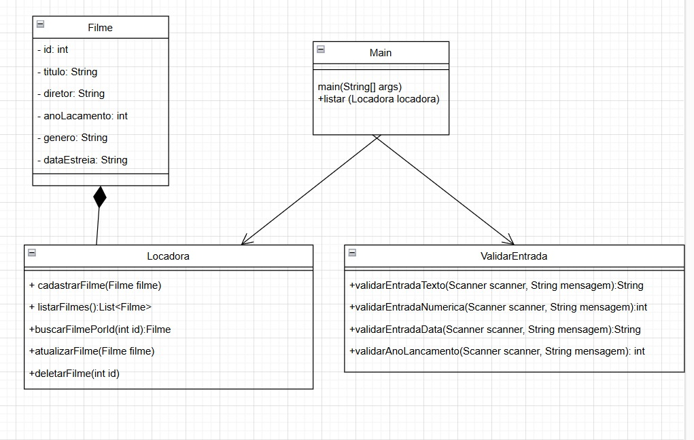
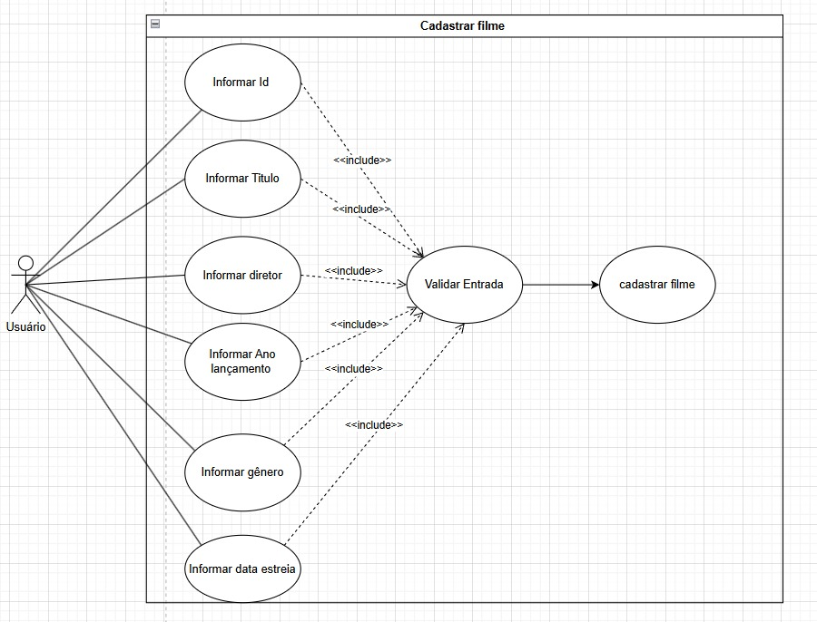

## Diagrama UML

   
  Figura 1 – Diagrama de Classes  

## Diagrama Caso de uso 

* Cadastrar Filme

   
  Figura 2 – Diagrama de Caso de Uso - Cadastrar Filme 

* Atualizar Filme

   
  Figura 3 – Diagrama de Caso de Uso - Atualizar Filme 

